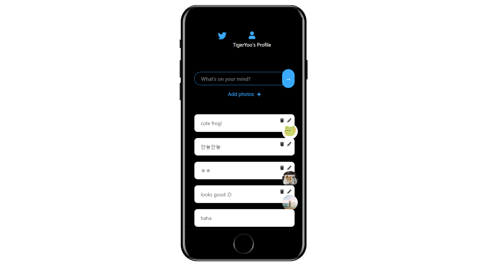

# nwitter

리액트 기반의 트위터 클론앱
* https://mtgvim.github.io/nwitter/
## 주요기능
* 회원가입/로그인/로그아웃, 메시지 CRUD, 이미지 업로드 기능

### 개발기간 🏗️
* 2021.12.09
   
### 기술 📚
* Lang
  * JavaScript
* FE
  * React
  * fortawesome
* BE
  * Firebase
* Budling
  * Webpack

### 빌드 방법 👷‍♂️
* ```zsh
  $ yarn
  $ yarn build
  ```
  빌드 결과물은 build 디렉토리에 생성
